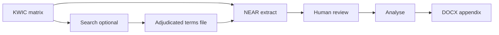

# TEXTURA Term Statistics — Technical Manual

**Corpus pipeline for NEAR co-occurrence mining, human adjudication, association statistics, and concordance appendices**

*Version aligned with schema near ≥ 2 · Suitable for rendering in [StackEdit](https://stackedit.io) (Markdown + LaTeX)*

---

## Abstract

This software suite supports a **lexicographic–corpus** research programme on *texture* (and related nodes) and a controlled **lexical field** of properties (e.g. uniformity, homogeneity, continuity). It operates on a large KWIC master matrix (`TEXTURA_TUDO_MATRIZ_v*.xlsx`), extracts NEAR/$x$ co-occurrences, assists human revision, computes association and diversity statistics, and projects nuclear attributions into APA-oriented DOCX concordances.

The methodological core is a **three-level ontology**:

1. **Master texture occurrence** = one row of the KWIC matrix  
2. **NEAR hit** = one lexical match inside that occurrence  
3. **Display window** = the exported context string (never an independent observation)

---

## Table of contents

1. [Objectives](#1-objectives)  
2. [System architecture](#2-system-architecture)  
3. [End-to-end pipeline](#3-end-to-end-pipeline)  
4. [Data model (schema near ≥ 2)](#4-data-model-schema-near--2)  
5. [NEAR extraction algorithms](#5-near-extraction-algorithms)  
6. [Syntactic classification](#6-syntactic-classification)  
7. [Statistical methods (with LaTeX)](#7-statistical-methods-with-latex)  
8. [Phase-3 DOCX appendix](#8-phase-3-docx-appendix)  
9. [Pedagogical tutorial](#9-pedagogical-tutorial)  
10. [CLI reference](#10-cli-reference)  
11. [Reproducibility & limits](#11-reproducibility--limits)  
12. [Bibliography of methods](#12-bibliography-of-methods)

---

## 1. Objectives

| Goal | How the code supports it |
|---|---|
| Inventory uses of a **pre-mapped lexical field** near *texture* | Boolean search + NEAR extraction over the master matrix |
| Separate **counts of hits** vs **counts of texture occurrences** | `match_id` / `texture_occurrence_id` |
| Avoid treating shifted KWIC windows as new observations | Window fusion (`janela_sobreposta`) + occurrence IDs |
| Support **human adjudication** (nuclear vs incidental) | Editable Excel sheet `8_Concordancia` |
| Quantify **attraction** of terms to the node vs a farther band | $2\times2$ association measures (OR, $G^2$, MI, logDice, …) |
| Test **polarity** and contingency structure | Binomial test, $\chi^2$ / Monte Carlo, Cramér’s $V$, BH |
| Produce a **readable concordance** with page cues | `textura_apendice.py` → DOCX (+ optional PDF page lookup) |

**Non-goals:** the suite does not re-OCR the corpus; it trusts the KWIC matrix. Absolute character offsets in the original PDF are not available—only positions inside the matrix context fragment.

---

## 2. System architecture

```
textura_gui.py          ← desktop orchestration (optional)
    │
    ├─ textura_search.py     Phase 0/1a — boolean NEAR over matrix → Results Excel
    ├─ textura_near.py       Phase 1b — full NEAR extract + spaCy → *_near.xlsx
    ├─ (human)               Phase 2a — revise 8_Concordancia
    ├─ textura_analise.py    Phase 2b — statistics & plots → *_analise.xlsx
    └─ textura_apendice.py   Phase 3  — DOCX concordance appendix

Supporting modules
    textura_lexico.py    lexical field, polarity, axes, doc_id
    textura_query.py     boolean query parser
    textura_triagem.py   domain triage / OCR noise
    textura_stats.py     logistic regression, BF, Hardie LR, CA, profiles
    textura_plots.py     frequency, clouds, sankey
    textura_legendas.py  plot title JSON
    textura_validacao.py validation helpers
```

**Typical data path**

```
TEXTURA_TUDO_MATRIZ_v7.xlsx
        │
        ▼
   UNIFORME.xlsx              (search Results — NOT for statistics)
   UNIFORME_termos_adjudicados.txt
        │
        ▼
   UNIFORME_near.xlsx         (extraction)
        │
        ▼
   UNIFORME_near_revisto_LR.xlsx
        │
        ▼
   UNIFORME_near_revisto_LR_analise.xlsx  + graphs
        │
        ▼
   Anexo_uniforme.docx / Anexo_uniforme_links.docx
```

---

## 3. End-to-end pipeline



### Phase 0 — Master matrix

- Sheet `Neighbor Contexts`, typically **no header**  
- Column 6 = NODE (`texture` …)  
- Column 12 = source path  
- Column 15 = full context (used for NEAR; neighbourhood columns 1–5 / 7–11 are **not** used for distance)

### Phase 1a — Optional boolean search (`textura_search.py`)

Builds a Results workbook and a `*_termos_adjudicados.txt` file from the query.  
Filters may include same-sentence and syntactic constraints.  
**Do not** feed the Results Excel into `textura_analise.py`.

### Phase 1b — NEAR extraction (`textura_near.py`)

Reads the matrix + terms file; emits schema-2 concordance:

- `8_Concordancia` / `8_Concordancia_Hits` — one row per hit  
- `8_Concordancia_Ocorrencias` — one row per matrix occurrence  
- `9_Excluidas`, `Duplicados`, `0_Instrucoes`, …

### Phase 2a — Human review

Edit yellow cells only: `relacao_sintactica`, `nuclear`, `polaridade`, `eixo`, `dominio`, `motivo_exclusao`, notes.  
Analysis keeps **`nuclear = TRUE`** only.

### Phase 2b — Analysis (`textura_analise.py`)

Frequencies, association table, contingency tests, optional regression/profiles, graphs.

### Phase 3 — Appendix (`textura_apendice.py`)

Nuclear rows → DOCX tables (excerpt | source). Optional parallel PDF page lookup:

- `(p. N)` = printed / page-label page (work/article)  
- `(PDF p. N)` = digital file leaf (not bibliographic)

---

## 4. Data model (schema near ≥ 2)

### 4.1 Three levels

| Level | Identifier | Statistical question |
|---|---|---|
| Occurrence | `texture_occurrence_id` = `{doc_id}::ROW_{source_matrix_row}` | How many texture occurrences show property $P$? |
| Hit | `hit_key` / `match_id` (`M001`…) | How many lexical matches? |
| Window | `contexto` | Display only |

$$
N_{\text{hits}} = \#\{\text{nuclear hits}\},\qquad
N_{\text{occurrences}} = \#\{\text{distinct }\texttt{texture\_occurrence\_id}\text{ with a nuclear hit}\}
$$

### 4.2 Important fields

| Field | Meaning |
|---|---|
| `source_matrix_row` | 1-based Excel row in the matrix |
| `off_no`, `off_termo` | Character offsets **inside the matrix context** |
| `idx_no`, `idx_termo` | Token indices in that context |
| `distancia`, `lado` | Token distance and side (`esq`/`dir`) |
| `n_janelas_fundidas` | How many shifted windows were fused into the survivor |
| `grupo_passagem_id` | Overlapping passage group (flag; different terms kept) |
| `candidato_duplicado` | Human-readable duplicate flags |

### 4.3 Fusion rules (automatic)

- Same `doc_id` + shared 8-gram + **same** `(canonical_term, matched_form)` → keep best survivor; others `motivo_exclusao = janela_sobreposta`  
- Same passage, **different** terms → flag only (`passagem_sobreposta`); do **not** delete  
- Truncation cleanup in DOCX **never** removes search terms (`matched_form`, `no`, …)

---

## 5. NEAR extraction algorithms

### 5.1 Normalisation and tokenisation

1. Unicode / hyphen-line normalisation (`normaliza`)  
2. Sentence boundary offsets (`fronteiras_frase`)  
3. Tokenisation preserving hyphenated compounds (`tokeniza`) → list of $(\text{form}, \text{char\_offset})$

### 5.2 Pattern compilation

Lexical patterns (`uniform*`, `*uniform`, multiword) compile to ordered regex sequences; longer matches win at a position (`compila_campo`, `_casa_em`).

### 5.3 Pairing (`emparelha_contexto`)

For each term span in the context:

1. Choose the closest node token in the same sentence (if sentence constraint on)  
2. Keep pairs with distance $\le x$ (NEAR/$x$)  
3. Collapse to **one hit per canonical type** in the window (closest pair)

Distance (in tokens):

$$
d(T,N)=\min_{k\in\mathrm{span}(T)} |k - i_N|
$$

### 5.4 Reference band

Beyond NEAR/$x$ up to `--banda` (default 12), hits feed a **positional baseline** (same contexts, farther tokens)—not the whole corpus.

### 5.5 Window overlap

Contexts $A,B$ (token sequences) are fused if they share a contiguous $n$-gram ($n=8$ by default):

$$
\exists\, g\in\mathrm{ngrams}(A,8)\cap\mathrm{ngrams}(B,8)
$$

---

## 6. Syntactic classification

Default: **spaCy** dependency parse (`relacao_dependencia`).

**Nuclear** (enter analysis if `nuclear=TRUE`):  
`atributiva`, `predicativa`, `predicativa_secundaria`, `nominal_composto`, `nominal_genitiva`, `adverbial`

**Non-nuclear:**  
`incidental`, `adverbial_verbal`, `adverbial_de_grau`, `coordenada`, `indeterminada`

Polarity poles and semantic axes come from the adjudicated lexicon (`textura_lexico.py`):

- polarity: `estabilidade` / `variabilidade`  
- axis: `homogeneidade_sincronica` / `invariancia_diacronica` / `ambos`

---

## 7. Statistical methods (with LaTeX)

> All display maths below use `$$...$$` for StackEdit / KaTeX / MathJax.

### 7.1 Contingency layout (window vs band)

For each canonical term:

$$
\begin{array}{c|cc}
 & \text{NEAR window} & \text{Reference band} \\ \hline
\text{term present} & O_{11} & O_{12} \\
\text{term absent} & O_{21}=r_1-O_{11} & O_{22}=r_2-O_{12}
\end{array}
$$

- $r_1$ = token count in NEAR windows (aggregated)  
- $r_2$ = token count in the farther band  
- $n = r_1+r_2$

Expected cell under independence:

$$
E_{ij}=\frac{(\text{row }i\text{ total})\times(\text{column }j\text{ total})}{n},\qquad
E_{11}=\frac{r_1\,(O_{11}+O_{12})}{n}
$$

*Implementation:* `textura_near.medidas_associacao`.

---

### 7.2 Odds ratio (Haldane–Anscombe) and Woolf CI

With continuity correction $+1/2$:

$$
\widehat{\mathrm{OR}}=\frac{(O_{11}+\tfrac12)(O_{22}+\tfrac12)}{(O_{12}+\tfrac12)(O_{21}+\tfrac12)}
$$

$$
\mathrm{SE}(\log\widehat{\mathrm{OR}})=\sqrt{\sum\frac{1}{O_{ij}+\tfrac12}}
$$

$$
\mathrm{CI}_{95\%}=\exp\!\Big(\log\widehat{\mathrm{OR}}\pm 1.96\,\mathrm{SE}\Big)
$$

**Reading:** $\mathrm{OR}>1$ → term more likely in the NEAR window than in the band.

---

### 7.3 Fisher’s exact test

Two-sided $p$-value for the $2\times2$ table (`scipy.stats.fisher_exact`). Used as a significance cue alongside OR.

---

### 7.4 Log-likelihood $G^2$ (signed)

$$
G^{2}=2\sum_{ij} O_{ij}\log\frac{O_{ij}}{E_{ij}}
\quad\text{(terms with }O_{ij}=0\text{ contribute }0\text{)}
$$

Sign convention in code: positive if $O_{11}\ge E_{11}$ (attraction), negative if repulsion.

---

### 7.5 Pointwise Mutual Information and MI3

$$
\mathrm{MI}=\log_2\frac{O_{11}}{E_{11}},\qquad
\mathrm{MI3}=\log_2\frac{O_{11}^{3}}{E_{11}}
$$

MI3 up-weights high absolute co-frequency (heuristic used in collocational practice).

---

### 7.6 $t$-score and $z$-score

$$
t=\frac{O_{11}-E_{11}}{\sqrt{O_{11}}},\qquad
z=\frac{O_{11}-E_{11}}{\sqrt{E_{11}}}
$$

---

### 7.7 Dice and logDice

With $N_{\mathrm{win}}$ = number of processed node windows (`janelas_kwic_processadas`):

$$
\mathrm{Dice}=\frac{2O_{11}}{N_{\mathrm{win}}+O_{11}+O_{12}}
$$

$$
\mathrm{logDice}=14+\log_2(\mathrm{Dice})
\quad\text{(Rychlý-style scaling)}
$$

*Implementation:* `textura_analise.logdice` / `medidas_associacao`.

---

### 7.8 $\Delta P$ (cue-outcome / directional association)

$$
\Delta P = \frac{O_{11}}{r_1}-\frac{O_{12}}{r_2}
$$

Positive $\Delta P$: higher relative frequency of the term in the NEAR band of tokens than in the distant band.

---

### 7.9 Hardie Log Ratio (optional module)

In `textura_stats.log_ratio` (effect size for keyness/collocation; sample-size stable):

$$
p_1=\frac{O_{11}+k}{r_1+2k},\quad
p_2=\frac{O_{12}+k}{r_2+2k},\quad
\mathrm{LR}=\log_2\frac{p_1}{p_2}
\quad(k=0.5\text{ by default})
$$

$\mathrm{LR}=1$ ≈ twice as probable in the window as in the band.

---

### 7.10 Dispersion: Gries $DP$

For parts (documents) with sizes $s_i$ and term counts $c_i$:

$$
DP=\frac12\sum_i\left|\frac{c_i}{\sum_j c_j}-\frac{s_i}{\sum_j s_j}\right|
$$

$DP=0$ uniform; $DP\to 1$ concentrated.  
*Implementation:* `dispersao_gries_dp`.

---

### 7.11 Juilland’s $D$

Let $v_i$ be counts per part (pad missing parts with 0), $\bar v$ their mean, $\mathrm{CV}=s/\bar v$:

$$
D=1-\frac{\mathrm{CV}}{\sqrt{n_{\mathrm{parts}}-1}}
$$

$D\to 1$ indicates even spread across parts.  
*Implementation:* `juilland_d`.

---

### 7.12 Diversity of the nuclear inventory

On frequencies $f_t$ of canonical terms among nuclear hits ($N=\sum f_t$, $S=\#\{t:f_t>0\}$):

**Shannon entropy**

$$
H=-\sum_t p_t\log p_t,\qquad p_t=\frac{f_t}{N}
$$

**Pielou evenness**

$$
J=\frac{H}{\log S}\quad(S>1)
$$

**Inverse Simpson**

$$
{}^{1}D=\frac{1}{\sum_t p_t^{2}}
$$

*Implementation:* `shannon`, `pielou`, `simpson_inverso`.

---

### 7.13 Polarity binomial test

Let $k$ = nuclear rows with `polaridade = estabilidade`, $n$ = nuclear rows with polarity filled, $p_0$ = null proportion (from reference band or lexicon):

$$
H_0:\; p=p_0,\qquad
\text{two-sided binomial test on }k\sim\mathrm{Bin}(n,p_0)
$$

Bootstrap percentile CI for $\hat p=k/n$ (`bootstrap_proporcao`).

---

### 7.14 Contingency tests and Cramér’s $V$

For categorical tables (e.g. relation × polarity), Pearson

$$
\chi^{2}=\sum\frac{(O-E)^{2}}{E}
$$

If any expected cell $<5$, a **Monte Carlo** $p$-value under the independence product of margins is used ($B$ permutations, default $20\,000$).

**Cramér’s $V$**

$$
V=\sqrt{\frac{\chi^{2}}{n\cdot\min(r-1,c-1)}}
$$

Deterministic collinearity: if $V\approx 1$ (or each row has a single non-zero cell), crossed tests are **blocked** (axis/polarity often functions of the lexicon).

---

### 7.15 Benjamini–Hochberg FDR

For $p$-values $p_{(1)}\le\cdots\le p_{(m)}$ within a family:

$$
p^{\mathrm{BH}}_{(i)}=\min_{j\ge i}\left(\min\Big(1,\,p_{(j)}\frac{m}{j}\Big)\right)
$$

*Implementation:* `benjamini_hochberg` (step-up from the largest rank).

---

### 7.16 Bayes factor for a proportion (optional)

Jeffreys / Beta$(1,1)$ marginal vs $H_0:p=p_0$ (`bayes_factor_proporcao`):

$$
\mathrm{BF}_{10}=\frac{B(k+1,n-k+1)}{p_0^{k}(1-p_0)^{n-k}}
$$

(with $B$ the beta function; coded via log-gamma).

---

### 7.17 Logistic regression (optional advanced sheet)

Bernoulli likelihood with logit link; IRLS; optional Firth penalty; cluster-robust SE by work (`doc_id`). Coefficients are **log-odds**.  
*Implementation:* `textura_stats.regressao_logistica`.

---

### 7.18 Correspondence analysis & profiles

- CA on contingency tables (`analise_correspondencias`)  
- Profile clustering / dendrogram for frequent types (`perfis_e_dendrograma`)

---

## 8. Phase-3 DOCX appendix

### Excerpt typography

- Straight quotes and ellipses: `"… …"`  
- Strip clearly truncated right-hand KWIC stubs (`in ora`)  
- **Never** remove `matched_form` / node forms  
- Optionally peel trailing function words (`of`, `the`, …) when the sentence is cut mid-phrase

### Page cues

Page numbers appear **after the excerpt** in the left column (not in the APA source cell):

`"… … excerpt …" (p. 45)` or `"… … excerpt …" (PDF p. 12)`

| Markup | Meaning |
|---|---|
| `(p. N)` | Work/article page (Excel column or real PDF page labels) |
| `(PDF p. N)` | 1-based leaf inside the PDF file |

Parallel PDF resolution: one worker pool; **each PDF opened once**; default workers $\approx 2\times\mathrm{CPU}$.

---

## 9. Pedagogical tutorial

### Lesson 1 — What problem are we solving?

You have tens of thousands of KWIC lines centred on *texture*. You also have a **thesaurus-driven** list of related words (uniform, homogeneous, continuous, …). You want to know:

1. Which of those words actually appear **near** *texture*?  
2. When they do, is the link **syntactically genuine** (modifier, predicate, …) or incidental?  
3. Relative to a **farther band** in the same contexts, do they concentrate near the node?  
4. How many **distinct texture occurrences** (matrix rows) are involved—not merely how many Excel lines?

### Lesson 2 — Why not delete “duplicates” blindly?

Suppose one matrix row contains:

> a continuous and relatively homogeneous texture

NEAR may yield **two hits** (`continuous`, `homogeneous`):

- $N_{\text{hits}}=2$  
- $N_{\text{occurrences}}=1$

Deleting one hit loses lexical evidence. Counting both as two occurrences inflates the class. Schema 2 keeps both levels.

### Lesson 3 — Walkthrough (Uniforme class)

**Step A — Choose the matrix** in the GUI (or CLI).

**Step B — Search (optional)** with a boolean NEAR query to draft `UNIFORME_termos_adjudicados.txt`. Clean typos (`regular*`, not `regurla*`); keep Portuguese runs separate (`--lingua pt`).

**Step C — Extract**

```bash
python textura_near.py ^
  --xlsx TEXTURA_TUDO_MATRIZ_v7.xlsx ^
  --termos UNIFORME_termos_adjudicados.txt ^
  --near 4 --lingua en ^
  --saida UNIFORME_near.xlsx
```

Check `0_Instrucoes`: `schema_near = 2`, `n_hits`, `n_ocorrencias`.

**Step D — Review** `8_Concordancia`

1. Filter `nuclear = TRUE`  
2. Kill false friends (`even*` → *event*, verbal *continues*, …)  
3. Trust `janela_sobreposta` exclusions; do not delete survivors with `n_janelas_fundidas > 1`  
4. Fill `polaridade` / `eixo` / `dominio` as needed  
5. Set `revisto_por_humano`

**Step E — Analyse**

```bash
python textura_analise.py --xlsx UNIFORME_near_revisto_LR.xlsx --desduplicacao nenhuma
```

Useful modes: `ocorrencia`, `ocorrencia_termo`, `contexto`.

**Step F — Appendix**

```bash
python textura_apendice.py ^
  --xlsx UNIFORME_near_revisto_LR.xlsx ^
  --saida Anexo_uniforme.docx ^
  --paginas-pdf --pdf-workers 16
```

Interpret `(p. N)` vs `(PDF p. N)` correctly in the thesis text.

### Lesson 4 — How to read the association sheet

Example pattern:

| Term | OR | Reading |
|---|---|---|
| `homogene` | $\approx 2.7$ | Attracted to NEAR vs band |
| `uniform` | $\approx 1.8$ | Attracted |
| `continu` | $<1$ | Still in the mapped field, but **less window-specific** |

A high raw frequency with OR $<1$ means: the thesaurus neighbour is productive in the broader neighbourhood, not sharply collocational in NEAR/$4$.

### Lesson 5 — Common pitfalls

1. Analysing the **search Results** Excel → wrong schema  
2. Treating `doc_id` as occurrence → undercounts within-document texture uses  
3. Mixing EN/PT patterns in one English-filtered run  
4. Citing `(PDF p. N)` as if it were the book page  
5. Ignoring collinearity warnings when polarity/axis are lexicon-determined  

### Lesson 6 — Minimal mental model of logDice

Dice asks: of all the “mass” of (node windows + term hits), how much is co-presence?

$$
\mathrm{Dice}=\frac{2O_{11}}{N_{\mathrm{win}}+O_{11}+O_{12}}
$$

logDice rescales to a familiar collocational range (Rychlý). Compare terms **within the same extract**, not against arbitrary external corpora.

### Lesson 7 — Suggested reporting template

1. Define the class via the **pre-mapped field** (thesaurus warrant)  
2. Report $N_{\text{hits}}$ and $N_{\text{occurrences}}$ after review  
3. Table of forms + OR / logDice / $G^2$  
4. Note non-nuclear exclusions and false-friend policy  
5. Qualitative concordance (Phase 3) with correct page semantics  

---

## 10. CLI reference

### `textura_near.py`

| Flag | Role |
|---|---|
| `--xlsx` | Matrix path |
| `--termos` | Adjudicated field file |
| `--near` | Window radius (tokens) |
| `--banda` | Outer band limit |
| `--lingua` | `en` / `pt` / `de` / `todas` |
| `--sintaxe` | `spacy` / `heuristica` |
| `--col-no` `--col-ctx` `--col-src` | Column numbers (defaults 6, 15, 12) |
| `--saida` | Output `*_near.xlsx` |
| `--so-extrair` / `--fases 1` | Extraction only (default workflow) |

### `textura_analise.py`

| Flag | Role |
|---|---|
| `--xlsx` | Reviewed near Excel |
| `--desduplicacao` | `nenhuma` / `contexto` / `candidatos` / `obra_termo` / `ocorrencia` / `ocorrencia_termo` |
| `--nulo-polaridade` | `banda` / `lexico` |
| `--relacao` | Optional subset of relations |

### `textura_apa7.py` (optional, before phase 3)

Standalone script: follow each work’s hyperlink/DOI (Crossref / HTML meta / local PDF), build APA 7 references, write a catalogue for `--refs`. Does **not** replace PDF page localisation.

```bash
python textura_apa7.py --xlsx UNIFORME_near.xlsx --saida refs_apa7.xlsx
python textura_apendice.py --xlsx UNIFORME_near.xlsx --refs refs_apa7.xlsx
```

| Flag | Role |
|---|---|
| `--xlsx` | Concordance Excel (`8_Concordancia`) |
| `--saida` | APA7 catalogue (xlsx/csv) |
| `--escrever-xlsx` | Also fill `fonte_apa` on the input Excel |
| `--limite` | Process only first N works (smoke test) |

### `textura_apendice.py`

| Flag | Role |
|---|---|
| `--xlsx` | Reviewed / analysed Excel |
| `--saida` | DOCX path (also writes `*_links.docx`) |
| `--paginas-pdf` / `--no-paginas-pdf` | PDF page localisation (on by default) |
| `--pdf-workers` | Parallelism (default $\sim 2\times$ CPU) |
| `--refs` | Optional APA7 catalogue |
| `--agrupar` | `query_pattern` / `canonical_term` / `termo_tipo` |

### GUI

`python textura_gui.py` — same phases with file pickers.

---

## 11. Reproducibility & limits

| Topic | Statement |
|---|---|
| RNG seeds | Monte Carlo / bootstrap use fixed seeds (`20260724`, `20260725`) unless changed |
| spaCy model | Default `en_core_web_sm`; results depend on model version |
| Matrix truncation | Contexts are short; `censurado_esq/dir` mark missing evidence |
| Band baseline | Positional, not whole-corpus keyness |
| Page labels | Many PDFs lack `/PageLabels` → only `(PDF p. N)` is honest |
| Human review | Required for publishable nuclear sets |

---

## 12. Bibliography of methods

- Evert, S. — association measures / collocational statistics  
- Rychlý, P. — logDice  
- Gries, S. Th. — $DP$ dispersion  
- Juilland & Chang-Rodriguez — Juilland’s $D$  
- Hardie, A. (2014) — Log Ratio  
- Benjamini & Hochberg (1995) — FDR  
- Firth — bias-reduced logistic regression (optional path)  
- APA 7 — reference presentation in the appendix  

---

## Appendix A — Module checklist

| Module | Responsibility |
|---|---|
| `textura_near.py` | NEAR mining, IDs, fusion, association primitives, diversity, BH |
| `textura_analise.py` | Phase-2 workbook, tests, frequencies, graphs hook |
| `textura_search.py` | Boolean search / Results Excel |
| `textura_apendice.py` | DOCX projection, excerpt cleanup, PDF pages |
| `textura_lexico.py` | Field loading, polarity, axes, `doc_id` |
| `textura_stats.py` | LR, BF, permutations, logistic, CA, profiles |
| `textura_triagem.py` | Domain filters, OCR noise |
| `textura_plots.py` | Visualisations |
| `textura_gui.py` | UI shell |
| `tests/` | Tokenisation, syntax, IDs, excerpt formatting |

---

## Appendix B — Quick formula sheet (copy into StackEdit)

$$
\mathrm{OR}=\frac{(O_{11}+\tfrac12)(O_{22}+\tfrac12)}{(O_{12}+\tfrac12)(O_{21}+\tfrac12)}
$$

$$
G^{2}=2\sum O\log\frac{O}{E}\quad(\text{signed by }O_{11}\gtrless E_{11})
$$

$$
\mathrm{MI}=\log_2\frac{O_{11}}{E_{11}},\quad
\mathrm{logDice}=14+\log_2\frac{2O_{11}}{N_{\mathrm{win}}+O_{11}+O_{12}}
$$

$$
\Delta P=\frac{O_{11}}{r_1}-\frac{O_{12}}{r_2},\quad
DP=\tfrac12\sum_i\big|c_i/\textstyle\sum c-s_i/\textstyle\sum s\big|
$$

$$
H=-\sum p_t\log p_t,\quad
J=H/\log S,\quad
{}^{1}D=1/\sum p_t^{2}
$$

$$
V=\sqrt{\chi^{2}/(n\min(r-1,c-1))}
$$

---

*End of manual. For operational review tips in Portuguese, see also `GUIA_REVISAO_FASE1.md` and `MIGRACAO.md`.*
